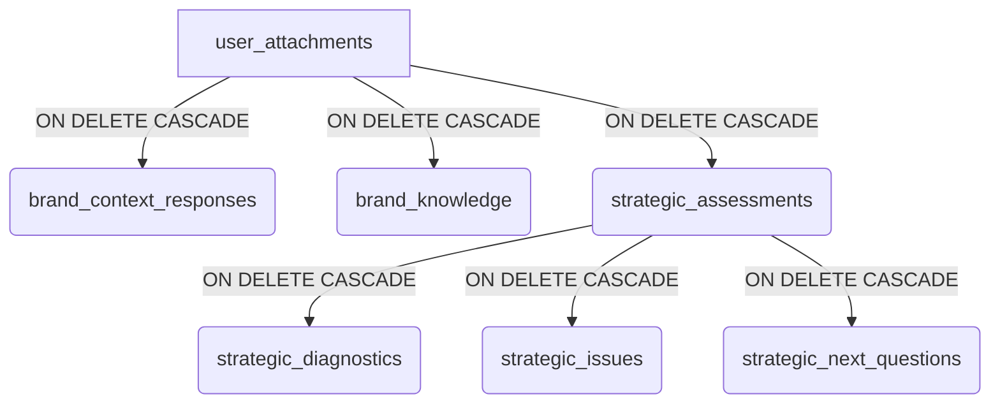

# Plano de Implementação: Rastreabilidade Ponta a Ponta de Anexos

## Objetivo
Remodelar o banco de dados e o pipeline do Planttô Brand OS para garantir que todo conhecimento e estratégia gerados a partir de um anexo (`user_attachments`) sejam rastreáveis e reversíveis. Se um anexo for deletado, tudo que derivou dele deve ser deletado em cascata, sem afetar o restante do ecossistema da marca.

## Diagnóstico Atual
Atualmente, o pipeline extrai informações do anexo para `brand_context_responses` (que já possui `source_attachment_id`). No entanto, quando essas respostas são promovidas para `brand_knowledge` ou avaliadas em `strategic_assessments`, o vínculo com o anexo original se perde. 

As tabelas `brand_knowledge`, `strategic_assessments`, `strategic_diagnostics`, `strategic_issues` e `strategic_next_questions` não possuem a coluna `source_attachment_id`.

## Plano de Ação

### Fase 1: Remodelagem do Banco de Dados (Schema)

Para garantir a rastreabilidade, precisamos propagar o `source_attachment_id` por toda a cadeia de valor.

1. **Adicionar `source_attachment_id` em `brand_knowledge`**
   - `ALTER TABLE public.brand_knowledge ADD COLUMN source_attachment_id uuid REFERENCES public.user_attachments(id) ON DELETE CASCADE;`
   - Isso garante que, se o anexo for deletado, o conhecimento extraído dele também será.

2. **Adicionar `source_attachment_id` em `strategic_assessments`**
   - `ALTER TABLE public.strategic_assessments ADD COLUMN source_attachment_id uuid REFERENCES public.user_attachments(id) ON DELETE CASCADE;`
   - Como as tabelas `strategic_diagnostics`, `strategic_issues` e `strategic_next_questions` já possuem `ON DELETE CASCADE` referenciando `assessment_id`, deletar o assessment deletará automaticamente seus filhos.

3. **Adicionar `source_attachment_id` em `memory_notes` (Opcional, mas recomendado)**
   - `ALTER TABLE public.memory_notes ADD COLUMN source_attachment_id uuid REFERENCES public.user_attachments(id) ON DELETE CASCADE;`
   - Caso o GPT gere notas baseadas puramente em um anexo.

### Fase 2: Atualização das Edge Functions (Pipeline)

As funções que movem dados de uma tabela para outra precisam ser atualizadas para carregar o `source_attachment_id` adiante.

1. **`promote-knowledge`**
   - Quando ler de `brand_context_responses`, deve capturar o `source_attachment_id`.
   - Ao inserir em `brand_knowledge`, deve incluir o `source_attachment_id`.

2. **`evaluate-strategy`**
   - O gatilho atual avalia a marca como um todo. Para isolar por anexo, a função deve ser capaz de gerar um `strategic_assessment` isolado para o anexo recém-processado.
   - Ao criar o `strategic_assessment`, deve preencher o `source_attachment_id`.

3. **`strategy-phase1-diagnostics` e subsequentes**
   - Não precisam de alteração estrutural, pois herdam o `assessment_id` que agora está vinculado ao anexo.

### Fase 3: Isolamento do Contexto na Geração

Para garantir que "1 anexo -> Vários ativos" funcione sem contaminação:

1. **Atualizar `briefing-from-attachments`**
   - Garantir que a extração olhe apenas para o texto do anexo atual, sem carregar o histórico completo da marca, evitando que o anexo "herde" conhecimento de outros anexos durante a extração.

2. **Atualizar `promote-knowledge`**
   - A consolidação deve ser feita por anexo. Se houver conflito com o conhecimento existente, o GPT (via `semantic_search`) resolverá isso em tempo de execução, não o pipeline de extração.

### Fase 4: Deleção em Cascata (O "Undo")

Graças às chaves estrangeiras com `ON DELETE CASCADE` configuradas na Fase 1, a exclusão de um anexo fará o banco de dados limpar automaticamente:
1. `brand_context_responses` (já configurado via `source_attachment_id`)
2. `brand_knowledge` (nova FK)
3. `strategic_assessments` (nova FK)
4. `strategic_diagnostics`, `strategic_issues`, `strategic_next_questions` (via `assessment_id`)
5. `embedding_queue` (já configurado)

Nenhum código adicional de deleção será necessário no backend; o PostgreSQL cuidará da integridade referencial.

## Resumo da Arquitetura Proposta

Com essa estrutura, o pipeline tem início, meio e fim isolados por anexo, e a exclusão do anexo reverte perfeitamente todo o processamento derivado dele.
